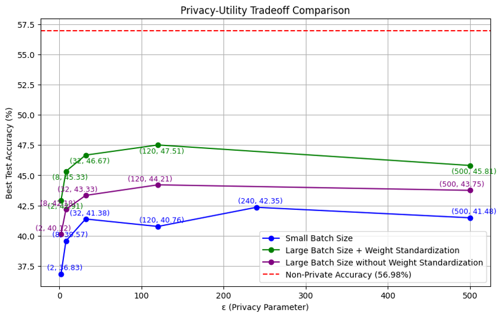
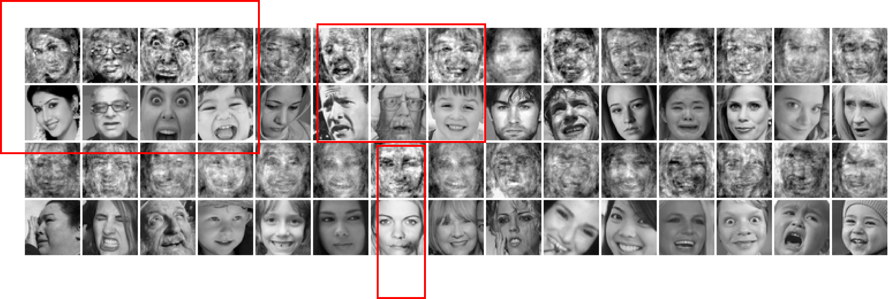

# Differentially Private Data-Reconstruction Attacks on FER2013

This repository explores data-reconstruction attacks and the efficacy of Differentially Private Stochastic Gradient Descent (DP-SGD) in mitigating privacy risks on the FER2013 dataset. Our project assesses how neural networks can leak private information through implicit bias and examines the impact of DP-SGD on model accuracy and privacy protection.

## Project Overview

### Research Objectives
1. **Data-Reconstruction Attack**: Investigate the feasibility of reconstructing training samples from a neural network trained on the FER2013 dataset.
2. **Differential Privacy (DP) Evaluation**: Apply DP-SGD with varying privacy parameters \((\epsilon, \delta) = (2, 10^{-5})\) to \((500, 10^{-5})\) and measure its impact on model accuracy.

### Key Findings
- **Reconstruction Success**: Data-reconstruction attacks on FER2013 effectively approximate training data, with reconstructed images showing 0.4 SSIM to original samples.
- **DP-SGD Accuracy**: Using DP-SGD with a batch size of 256 and weight standardization, we achieved a maximum test accuracy of **47.5%** on FER2013, compared to the non-private baseline accuracy of **56.98%**.
- **Privacy-Utility Trade-off**: Larger batch sizes and weight standardization significantly improve accuracy under privacy constraints.

## Results

Below are key figures illustrating our findings:

### Figure 1: Privacy-Utility Tradeoff for FER2013

*Test accuracy versus privacy parameter \(\epsilon\) on FER2013. The highest accuracy under DP constraints (47.5%) is achieved with a batch size of 256 and weight standardization.*

### Figure 2: Data-Reconstruction Attack Results

*Top: Original training images from FER2013; Bottom: Reconstructed images using data-reconstruction attacks. SSIM scores indicate high visual similarity.*

## Repository Structure

- `dataset_reconstruction/`: Source code for data-reconstruction attack 
    - Code Reference : https://github.com/nivha/dataset_reconstruction
- `dp-sgd/`: Jupyter notebboks for perform DP-SGD on FER2013 dataset performing on different hyperparameters and model architecture
- `datasets/`: Create fer2013 folder inside this and add train and test datasets from  https://www.kaggle.com/c/challenges-in-representation-learning-facial-expression-recognition-challenge/data

